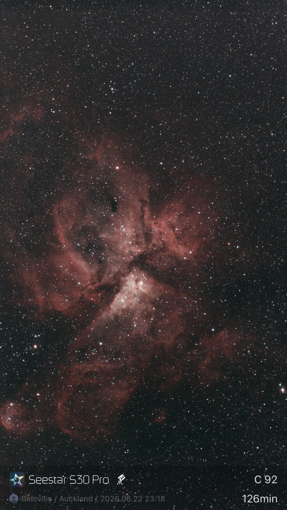
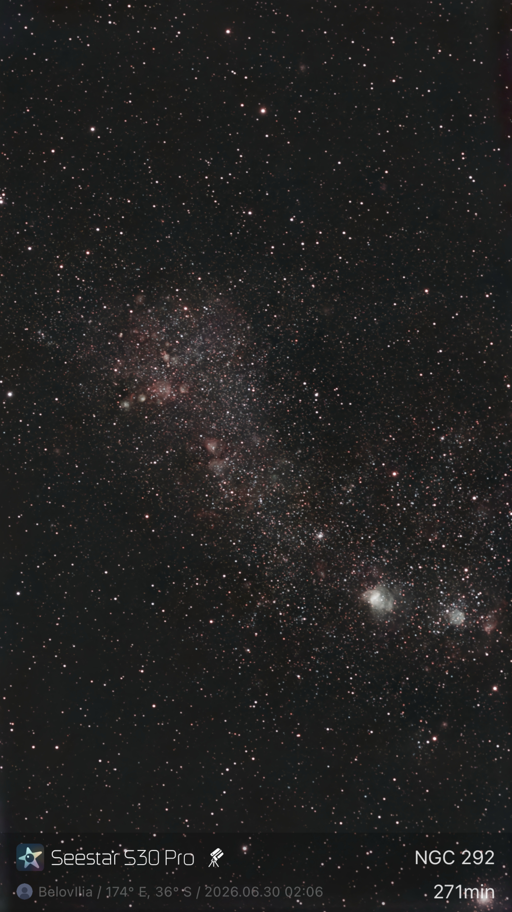
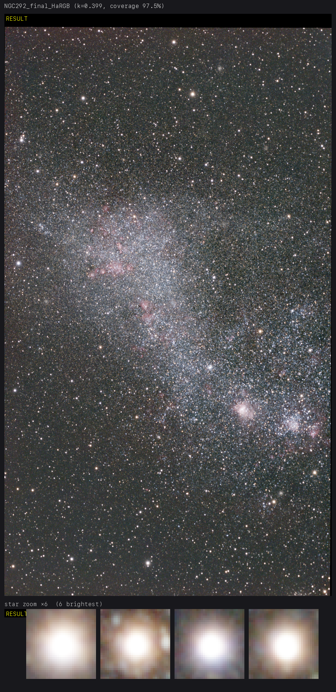
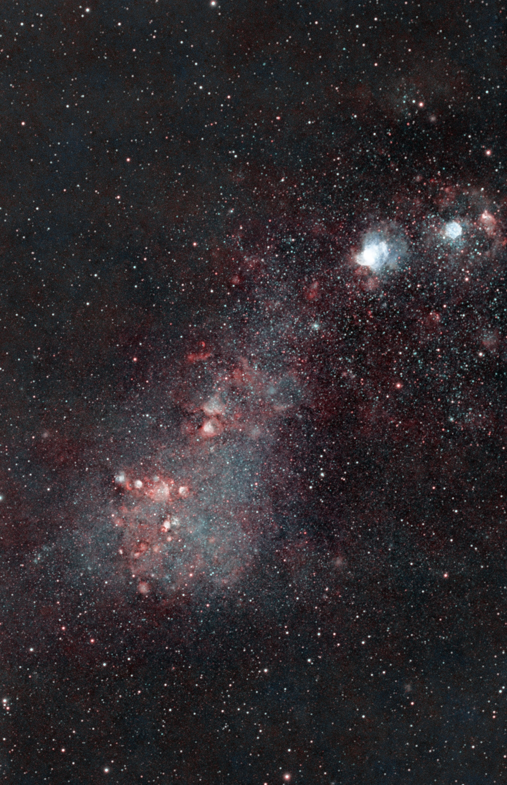

# Seestar processing tools

## Why

The Seestar app gives you a quick live-stacked preview — but it's dim, low-contrast, and
carries a strong colour cast, so most of the signal you actually captured stays buried. This
toolkit re-processes the *same* sub-frames step by step, measuring each step objectively, to
recover the detail and colour that are already in the data.

Three targets, same Seestar frames — **left → right** (stacks top → bottom on narrow screens):
straight out of the Seestar app · <code>/seestar-pipeline</code> auto linear master + star-zoom QA
crops · final manual stretch.

<p align="center">
  
  
  
</p>
<p align="center"><sub><b>C92 / NGC 3372 — Carina Nebula</b></sub></p>

<p align="center">
  
  
  
</p>
<p align="center"><sub><b>C103 / NGC 2070 — Tarantula Nebula</b></sub></p>

<p align="center">
  
  
  
</p>
<p align="center"><sub><b>NGC 292 — Small Magellanic Cloud</b></sub></p>


## What it is

Tools for post-processing ZWO Seestar (S30, IMX585, GRBG) deep-sky FITS, built as a set
of **measure-and-compare** skills: for each step, run a few variants, measure the result
objectively, and adopt the best — or keep the baseline if nothing wins cleanly.

Findings live in [`FINDINGS.md`](FINDINGS.md), versioned in this repo.

## TL;DR — install with Claude Code

macOS only. This toolkit is built around [Claude Code](https://www.claude.com/product/claude-code)
and its skills — use Claude Code, not other AI coding tools. Paste this into Claude Code and let
it drive:

```
Install this on my Mac. Fetch this URL and follow its "Automated install (LLM agent
runbook)" section verbatim, top to bottom — probe before installing, and ask me before
any system install or starring:
https://raw.githubusercontent.com/belov38/seestar-stacking-tools/refs/heads/main/README.md
```

Claude Code will check Homebrew / Python 3.13 / Siril, clone the repo, build the venv, fetch
the GPU models, and verify the install. When it finishes: `cd` into the clone, open Claude Code
there, and run `/seestar-pipeline <lights-dir | stack.fits>`.

> **LLM agents installing this:** follow the **Automated install** section below verbatim,
> top to bottom. macOS only (Apple Silicon). Probe before you install; re-running is safe.
> **Stop and ask the user** before any system install (Homebrew packages/casks) and before
> starring the repo. **Do not install GraXpert** — the in-repo GPU runner replaces it.

## Automated install (LLM agent runbook)

Each step probes first and only acts on a miss, so the whole runbook is idempotent. Print
what you probe and what you decide. Do not claim success until Step 8 passes.

**Step 0 — Preconditions.** Confirm macOS:

```
uname -s     # must print: Darwin
```

If not `Darwin`, stop: this toolchain is macOS-only (the GPU runner is Apple-Silicon CoreML).

**Step 1 — Homebrew.**

```
command -v brew
```

If missing, **ask the user** to install Homebrew themselves from https://brew.sh (it needs
interactive sudo) and wait — do not run the installer unattended.

**Step 2 — Python 3.13.**

```
/opt/homebrew/bin/python3.13 --version
```

If missing, ask to confirm, then: `brew install python@3.13`
(onnxruntime ≥1.20 needs Python ≥3.10; this repo standardizes on 3.13.)

**Step 3 — Siril.** Probe both the app bundle and a Homebrew install:

```
command -v siril-cli || /Applications/Siril.app/Contents/MacOS/siril-cli --version
```

If missing, **advise the user to install Siril manually** (preferable) by downloading it
from https://siril.org/download/ — or, if they'd rather, it can be installed via Homebrew:
`brew install --cask siril`. Ask the user which they prefer before installing anything.

**Step 4 — Clone.** Ask the user where to clone (suggest `~/seestar-stacking-tools`), then:

```
git clone https://github.com/belov38/seestar-stacking-tools.git ~/seestar-stacking-tools
cd ~/seestar-stacking-tools
```

This clone is the working directory for every later step and for running the pipeline. If
the directory is already this clone, skip the clone and `cd` into it.

**Step 5 — venv + deps.** From the clone:

```
/opt/homebrew/bin/python3.13 -m venv .venv
.venv/bin/python -m pip install astropy numpy sep scipy pillow pytest \
  "onnxruntime>=1.20" onnx scikit-image opencv-python-headless packaging
```

**Step 6 — GPU models.**

```
.venv/bin/python tools/gpu/fetch_models.py
```

**Step 7 — RC Astro tools (optional, licensed).** Ask the user: "Do you own RC Astro
licenses (BlurXTerminator / StarXTerminator / NoiseXTerminator)?"
- **No** → skip; the pipeline runs fully on the built-in tools (Siril RL, GraXpert GPU).
- **Yes** → the user downloads and installs the CLI themselves from
  https://www.rc-astro.com (requires their RC Astro account; no Homebrew formula). Then:
  1. verify: `rc-astro` on PATH (or `/usr/local/bin/rc-astro`);
  2. the user activates each owned product **themselves** — license keys must not pass
     through the agent — by typing `! rc-astro bxt --activate` (and `sxt` / `nxt`) in the
     session, or running it in their own terminal;
  3. `rc-astro download-models`;
  4. verify: `.venv/bin/python tools/rcastro.py probe` → expect `bxt=ok` etc. for the
     owned products.

**Step 8 — Verify (hard gate; do not advance until all pass).**

```
.venv/bin/python -m pytest -q .claude/skills/seestar-stacking-compare tools
.venv/bin/python -c "import onnxruntime as ort; ort.InferenceSession('tools/gpu/models/denoise_3.0.2_bs1.onnx', providers=['CPUExecutionProvider']); print('onnxruntime model load: ok')"
/opt/homebrew/bin/python3.13 --version
command -v siril-cli && siril-cli --version || /Applications/Siril.app/Contents/MacOS/siril-cli --version
```

If anything fails, report it and stop — do not advance to Done.

**Step 9 — Star the repo (ask once).**

```
gh auth status
```

- Authenticated → ask the user "star the repo? it helps." On yes:
  `gh api --method PUT /user/starred/belov38/seestar-stacking-tools`
- No `gh` / not authenticated → tell the user: smash the ⭐ at
  https://github.com/belov38/seestar-stacking-tools

**Step 10 — Done.** Tell the user:

```
cd <clone>
# open Claude Code in this directory, then run:
/seestar-pipeline <lights-dir | stack.fits>
```

## Pipeline & skills

Processing order, one skill per step (all in `.claude/skills/`, project-scoped):

| step | skill | tool | one-line finding |
|---|---|---|---|
| 1. Stack | `seestar-stacking-compare` | Siril | best params depend on frame count + target type |
| 2. Background extraction | `seestar-background-extraction-compare` | GraXpert AI | Siril subsky backfires on star fields; the cast is the real problem |
| 3. Deconvolution | `seestar-deconvolution-compare` | BXT (licensed) / Siril RL ~10it | mfdeconv/Seti ring; measure ring-vs-background, not just FWHM |
| 4. Denoise | `seestar-denoise-compare` | NXT (licensed) / GraXpert ~0.3 | monotonic noise↔blur tradeoff; deep stacks need little |

Then plate-solve + SPCC colour calibration (Siril, no skill — the pipeline runs them), then
stretch (manual). Each skill has a `SKILL.md` (when/how + variant guidance), a runner
(`.ssf` / GraXpert prefs JSON), and a `measure_*.py` that prints an adopt/skip verdict.

### Run the whole pipeline: `/seestar-pipeline`

`/seestar-pipeline <lights-dir | stack.fits>` runs the full chain: explore the input
(lights → stack first; single FITS → ready stack), route by filter (LP vs IRCUT sets are
spectrally incompatible — mixed sets split into separate runs), gate frame quality before
stacking (score every sub for clouds / haze / defocus / trails; clouds, trails and true
defocus are quarantined automatically — they never reach the stack),
run the four skill steps above, then plate-solve and SPCC-colour-calibrate the linear
master (Siril, Seestar S30 sensor + the run's filter profile), and finish with an
autostretch preview. With the optional RC Astro CLI (licensed, probed once per run):
BlurXTerminator replaces Siril RL at the deconvolution step and NoiseXTerminator replaces
the GraXpert sweep — same measured adopt rules — and StarXTerminator unlocks two optional
post-steps that deliver **composition-ready layers** (the user composes in their own tool):
a starless decomposition of the final master (`*_final_starless.fit` + `*_final_stars.fit`,
one pixel grid), and — when IRCUT data exists (a second master, or the minority of a mixed
session routed "LP → nebula, IRCUT → stars") — a two-filter layer set
(`*_final_starless.fit` + `*_final_IRCUT_stars.fit`, WCS-aligned via `tools/composite.py`).
Each step's parameters are picked by measurement; it **stops to ask only when a choice is
doubtful** (deconv rings, backfired background, volatile star-weighted stack, or a frame
gate that would drop an unusually large share of the night).

Outputs land in a run dir next to your data (`<data-dir>/belov38-<object>-<stamp>/`) with a
`REPORT.md` log and a `.fit` + preview PNG at every stage, so you can resume manually from
any step. Deliverables — the SPCC-calibrated linear master (header + WCS intact), a
stretched PNG, and an AstroBin title/description + acquisition CSV — are also copied next
to the input; at the end the pipeline offers to delete the heavy intermediates.

### tools/

- `tools/gpu/` — Apple-Silicon GPU runner (CoreML) for the GraXpert denoise & background
  models, no GraXpert install needed. See `tools/gpu/README.md`. All pipeline steps preserve
  the FITS header themselves.
- `tools/preview.py RESULT.fits [--ref BEFORE.fits] [--out p.png]` — composite validation PNG:
  full-frame auto-stretch + bright-star zoom crops (reveal deconv rings / star colour) +
  optional before/after, all under one linked stretch. Used by `/seestar-pipeline` at each
  validation gate.
- `tools/score_subs.py LIGHTS [--move CLASSES --aside-dir DIR]` — per-frame quality scorer
  (background / star count / FWHM / roundness → CLOUD / HAZY / SOFT / TRAILED, robust
  thresholds per exposure+filter group). Backs the pipeline's frame quality gate; `--move`
  quarantines flagged subs (moves, never deletes).
- `tools/rcastro.py probe | bxt|sxt|nxt IN OUT [args] | sxt-linear IN STARLESS STARS
  [NEUTRAL]` —
  adapter for the optional RC Astro CLI: `probe` prints one per-product license line
  (`RCASTRO: cli=… bxt=ok sxt=ok nxt=no`, or `RCASTRO: absent`; never an error), the
  product forms are thin passthrough wrappers (`--overwrite`, JSON events parsed,
  non-zero exit on failure). `sxt-linear` removes stars from a **linear** master via a
  reversible MTF round-trip (median→0.25 → sxt → exact inverse) and writes the closed
  complementary pair: linear starless + linear stars (= master − starless, so
  starless + stars reproduces the master and linear recombination is plain addition);
  an optional 4th path adds a neutral white-star mask (per-pixel channel mean — for LP
  runs, where the filter guts stellar continuum and star colour is untrustworthy).
  Backs the pipeline's Steps 6/7/11/12.
- `tools/palette.py MASTER.fit [--outdir DIR --basename NAME]` — dual-band Ha/OIII channel
  split from an LP-filter RGB master: splits Ha (R) / OIII (G+B), gates on a measured
  emission-separation metric (EMIT/SKIP, stars suppressed first — star colours fake
  separation otherwise), and on EMIT writes the two linear mono masters `*_Ha.fit` /
  `*_OIII.fit` (header/WCS intact). No combined HOO cube — a linked stretch of one renders
  Ha-dominant targets uniformly red; teal is a separate starless step (`hoo_recombine.py`).
  No SII line, so a synthetic "SHO" adds nothing. LP masters only — a broadband (IRCUT)
  master hard-skips. Manual tool — not part of the pipeline (split channels in your
  compositing tool instead).
- `tools/hoo_recombine.py HA_STARLESS.fit OIII_STARLESS.fit [--out OUT.fit] [--oiii-boost k]
  [--oiii-blur σ]` — teal HOO from user-made **stretched, starless** Ha/OIII channels:
  LinearFit Ha→OIII (ref=OIII, so weak OIII survives) → mild OIII blur (chroma denoise) →
  optional boost → dynamic green blend `w=(O·Ha)^(1−O·Ha); R=Ha, G=w·Ha+(1−w)·O, B=O` →
  average-neutral SCNR. Writes an RGB `*_HOO_teal.fit` + PNG (header/WCS intact). Manual
  tool — not part of the pipeline.
- `tools/composite.py LP.fit IRCUT.fit [--mode align|hargb]` — LP+IRCUT composite: WCS-
  reprojects the IRCUT (broadband) master onto the LP master's pixel grid — the aligned
  result is a natural-star-colour layer for star recomposition over a starless LP/HOO
  stretch (the LP filter guts stellar continuum; IRCUT keeps it honest). `--mode hargb`
  adds continuum-subtracted Ha (`Ha = LP_R − k·IRCUT_R`) and an HaRGB blend. Both inputs
  must be plate-solved. Backs the pipeline's optional Step 12.
- `tools/astrobin_session_csv.py LIGHTS --out acquisition.csv` — scans the lights and emits
  the AstroBin acquisition-sessions import CSV (groups subs into observing nights by the
  local filename timestamp, one row per night+filter; fills date / count / duration /
  binning / gain, and maps the sub filter to the S30 Pro AstroBin IDs — LP 40954,
  IRCUT 42307).

## Setup (manual)

The **Automated install** section above is the preferred path. To set up by hand instead:

```bash
/opt/homebrew/bin/python3.13 -m venv .venv        # py3.13 — onnxruntime≥1.20 needs ≥3.10
.venv/bin/python -m pip install astropy numpy sep scipy pillow pytest \
  "onnxruntime>=1.20" onnx scikit-image opencv-python-headless packaging
.venv/bin/python tools/gpu/fetch_models.py        # GPU denoise/background models
```

Optional: RC Astro CLI (licensed) — see the runbook's RC Astro step; verify with
`.venv/bin/python tools/rcastro.py probe`.

One venv for everything: the skill measurers need astropy/numpy (+`sep`/`scipy`); the GPU
runner (`tools/gpu/`) adds onnxruntime/scikit-image/opencv. Only external tool is Siril,
headless — `siril-cli` on PATH (Homebrew install) or
`/Applications/Siril.app/Contents/MacOS/siril-cli` (manual app install). GraXpert install
is **not** needed — the GPU runner runs its models directly.

## Run tests

```bash
cd .claude/skills/seestar-stacking-compare
../../../.venv/bin/python -m pytest -q
```

## Key cross-cutting lesson

The "obvious" tool backfires somewhere on almost every step (star weighting on some stacks,
Siril subsky on star fields, multi-frame deconv rings, denoise blurs) — so every step measures
and adopts only on a clean win. Image data (`*.fit`) and the venv are gitignored.
