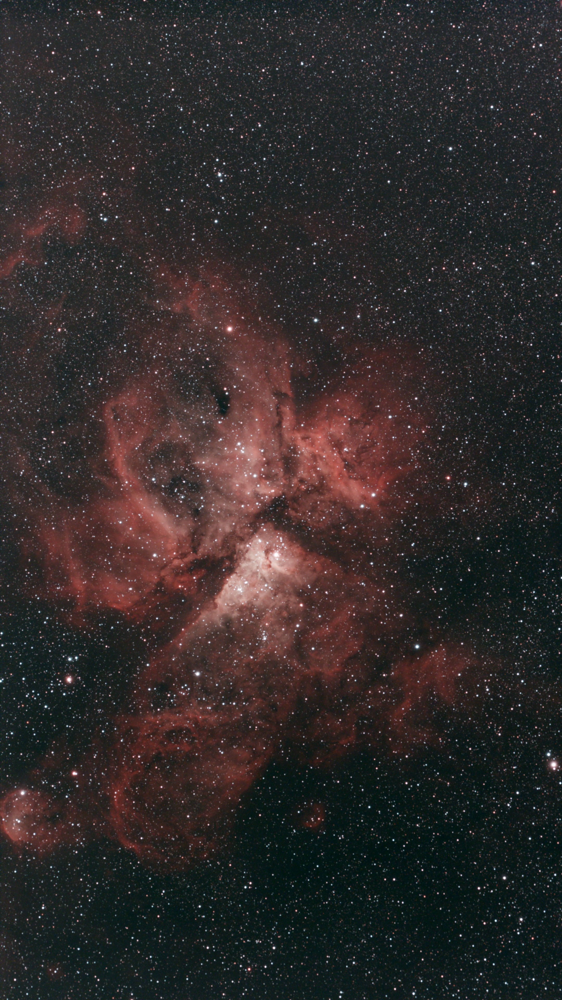
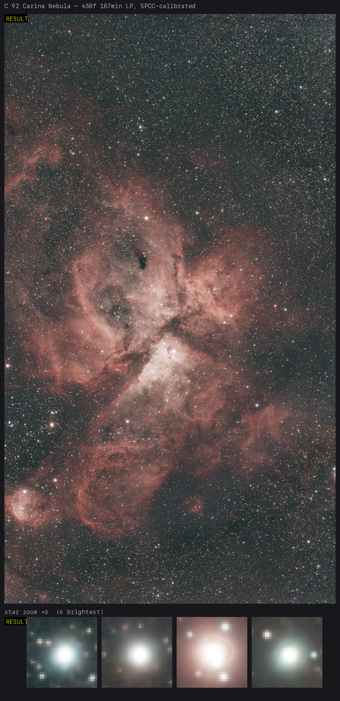
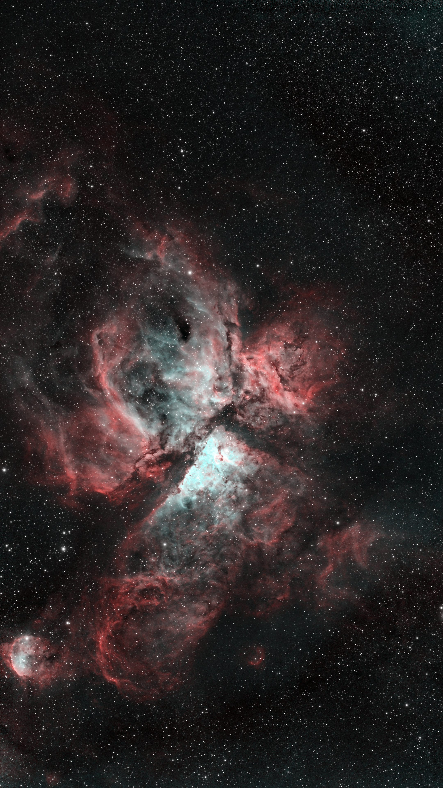
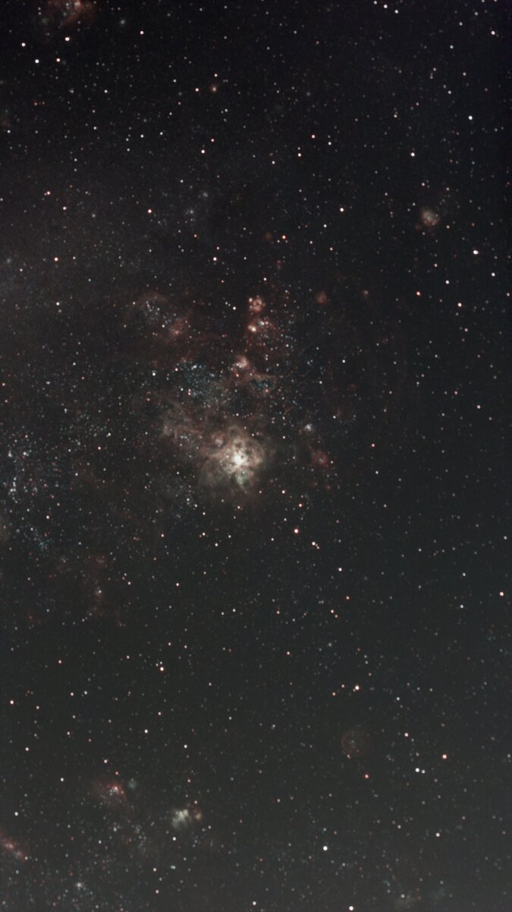
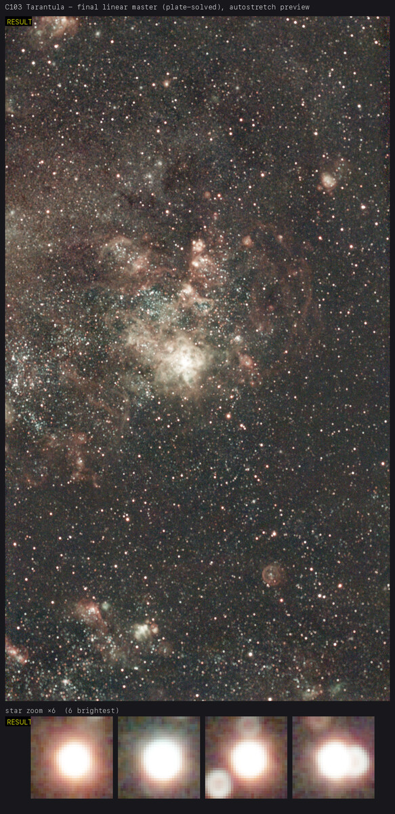
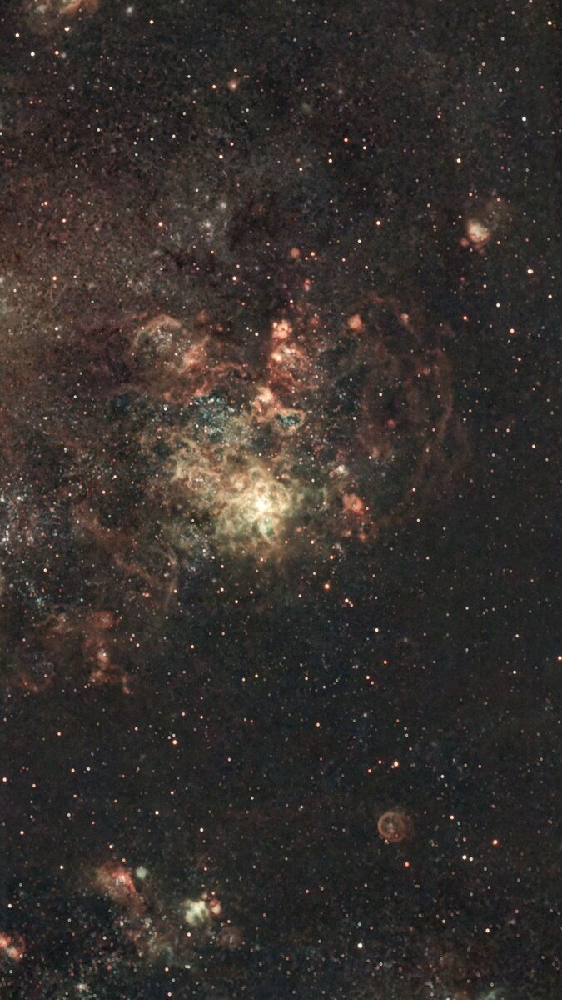

# Seestar processing tools

## Why

The Seestar app gives you a quick live-stacked preview — but it's dim, low-contrast, and
carries a strong colour cast, so most of the signal you actually captured stays buried. This
toolkit re-processes the *same* sub-frames step by step, measuring each step objectively, to
recover the detail and colour that are already in the data.

Two targets, same Seestar frames — **left → right** (stacks top → bottom on narrow screens):
straight out of the Seestar app · <code>/seestar-pipeline</code> auto linear master + star-zoom QA
crops · final manual stretch.

<p align="center">
  
  
  
</p>
<p align="center"><sub><b>C92 / NGC 3372 — Carina Nebula</b></sub></p>

<p align="center">
  
  
  
</p>
<p align="center"><sub><b>C103 / NGC 2070 — Tarantula Nebula</b></sub></p>

**References:** [ZWO Seestar](https://www.seestar.com/) ·
[Carina Nebula / NGC 3372](https://en.wikipedia.org/wiki/Carina_Nebula) ·
[Tarantula Nebula / NGC 2070](https://en.wikipedia.org/wiki/Tarantula_Nebula) ·
[Siril](https://siril.org/) · [GraXpert](https://www.graxpert.com/)

## What it is

Tools for post-processing ZWO Seestar (S30, IMX585, GRBG) deep-sky FITS, built as a set
of **measure-and-compare** skills: for each step, run a few variants, measure the result
objectively, and adopt the best — or keep the baseline if nothing wins cleanly.

Findings live in [`FINDINGS.md`](FINDINGS.md), versioned in this repo.

## TL;DR — install with Claude Code

macOS only. This toolkit is built around [Claude Code](https://www.claude.com/product/claude-code)
and its skills — use Claude Code, not other AI coding tools. Paste this into Claude Code and let
it drive:

```
Install this on my Mac. Fetch this URL and follow its "Automated install (LLM agent
runbook)" section verbatim, top to bottom — probe before installing, and ask me before
any system install or starring:
https://raw.githubusercontent.com/belov38/seestar-stacking-tools/refs/heads/main/README.md
```

Claude Code will check Homebrew / Python 3.13 / Siril, clone the repo, build the venv, fetch
the GPU models, and verify the install. When it finishes: `cd` into the clone, open Claude Code
there, and run `/seestar-pipeline <lights-dir | stack.fits>`.

> **LLM agents installing this:** follow the **Automated install** section below verbatim,
> top to bottom. macOS only (Apple Silicon). Probe before you install; re-running is safe.
> **Stop and ask the user** before any system install (Homebrew packages/casks) and before
> starring the repo. **Do not install GraXpert** — the in-repo GPU runner replaces it.

## Automated install (LLM agent runbook)

Each step probes first and only acts on a miss, so the whole runbook is idempotent. Print
what you probe and what you decide. Do not claim success until Step 7 passes.

**Step 0 — Preconditions.** Confirm macOS:

```
uname -s     # must print: Darwin
```

If not `Darwin`, stop: this toolchain is macOS-only (the GPU runner is Apple-Silicon CoreML).

**Step 1 — Homebrew.**

```
command -v brew
```

If missing, **ask the user** to install Homebrew themselves from https://brew.sh (it needs
interactive sudo) and wait — do not run the installer unattended.

**Step 2 — Python 3.13.**

```
/opt/homebrew/bin/python3.13 --version
```

If missing, ask to confirm, then: `brew install python@3.13`
(onnxruntime ≥1.20 needs Python ≥3.10; this repo standardizes on 3.13.)

**Step 3 — Siril.**

```
/Applications/Siril.app/Contents/MacOS/siril-cli --version
```

If missing, ask to confirm, then: `brew install --cask siril`

**Step 4 — Clone.** Ask the user where to clone (suggest `~/seestar-stacking-tools`), then:

```
git clone https://github.com/belov38/seestar-stacking-tools.git ~/seestar-stacking-tools
cd ~/seestar-stacking-tools
```

This clone is the working directory for every later step and for running the pipeline. If
the directory is already this clone, skip the clone and `cd` into it.

**Step 5 — venv + deps.** From the clone:

```
/opt/homebrew/bin/python3.13 -m venv .venv
.venv/bin/python -m pip install astropy numpy sep scipy pillow pytest \
  "onnxruntime>=1.20" onnx scikit-image opencv-python-headless packaging
```

**Step 6 — GPU models.**

```
.venv/bin/python tools/gpu/fetch_models.py
```

**Step 7 — Verify (hard gate; do not advance until all pass).**

```
.venv/bin/python -m pytest -q .claude/skills/seestar-stacking-compare tools
.venv/bin/python -c "import onnxruntime as ort; ort.InferenceSession('tools/gpu/models/denoise_3.0.2_bs1.onnx', providers=['CPUExecutionProvider']); print('onnxruntime model load: ok')"
/opt/homebrew/bin/python3.13 --version
/Applications/Siril.app/Contents/MacOS/siril-cli --version
```

If anything fails, report it and stop — do not advance to Done.

**Step 8 — Star the repo (ask once).**

```
gh auth status
```

- Authenticated → ask the user "star the repo? it helps." On yes:
  `gh api --method PUT /user/starred/belov38/seestar-stacking-tools`
- No `gh` / not authenticated → tell the user: smash the ⭐ at
  https://github.com/belov38/seestar-stacking-tools

**Step 9 — Done.** Tell the user:

```
cd <clone>
# open Claude Code in this directory, then run:
/seestar-pipeline <lights-dir | stack.fits>
```

## Pipeline & skills

Processing order, one skill per step (all in `.claude/skills/`, project-scoped):

| step | skill | tool | one-line finding |
|---|---|---|---|
| 1. Stack | `seestar-stacking-compare` | Siril | best params depend on frame count + target type |
| 2. Background extraction | `seestar-background-extraction-compare` | GraXpert AI | Siril subsky backfires on star fields; the cast is the real problem |
| 3. Deconvolution | `seestar-deconvolution-compare` | Siril RL ~10it | mfdeconv/Seti ring; measure ring-vs-background, not just FWHM |
| 4. Denoise | `seestar-denoise-compare` | GraXpert ~0.3 | monotonic noise↔blur tradeoff; deep stacks need little |

Then stretch (manual). Each skill has a `SKILL.md` (when/how + variant guidance), a runner
(`.ssf` / GraXpert prefs JSON), and a `measure_*.py` that prints an adopt/skip verdict.

### Run the whole pipeline: `/seestar-pipeline`

`/seestar-pipeline <lights-dir | stack.fits>` chains all four steps: auto-detects the input
(lights → stack first; single FITS → ready stack), picks each step's parameters by measurement,
and **stops to ask only when a choice is doubtful** (deconv rings, backfired background, volatile
star-weighted stack). Outputs land under `out/pipeline/<object>_<stamp>/` with a `REPORT.md` log;
the deliverable is a header-complete linear FITS plus a stretched PNG.

### tools/

- `tools/gpu/` — Apple-Silicon GPU runner (CoreML) for the GraXpert denoise & background
  models, no GraXpert install needed. See `tools/gpu/README.md`. All pipeline steps preserve
  the FITS header themselves.
- `tools/preview.py RESULT.fits [--ref BEFORE.fits] [--out p.png]` — composite validation PNG:
  full-frame auto-stretch + bright-star zoom crops (reveal deconv rings / star colour) +
  optional before/after, all under one linked stretch. Used by `/seestar-pipeline` at each
  validation gate.

## Setup (manual)

The **Automated install** section above is the preferred path. To set up by hand instead:

```bash
/opt/homebrew/bin/python3.13 -m venv .venv        # py3.13 — onnxruntime≥1.20 needs ≥3.10
.venv/bin/python -m pip install astropy numpy sep scipy pillow pytest \
  "onnxruntime>=1.20" onnx scikit-image opencv-python-headless packaging
.venv/bin/python tools/gpu/fetch_models.py        # GPU denoise/background models
```

One venv for everything: the skill measurers need astropy/numpy (+`sep`/`scipy`); the GPU
runner (`tools/gpu/`) adds onnxruntime/scikit-image/opencv. Only external tool is Siril
(`/Applications/Siril.app/Contents/MacOS/siril-cli`), headless. GraXpert install is **not**
needed — the GPU runner runs its models directly.

## Run tests

```bash
cd .claude/skills/seestar-stacking-compare
../../../.venv/bin/python -m pytest -q
```

## Key cross-cutting lesson

The "obvious" tool backfires somewhere on almost every step (star weighting on some stacks,
Siril subsky on star fields, multi-frame deconv rings, denoise blurs) — so every step measures
and adopts only on a clean win. Image data (`*.fit`) and the venv are gitignored.
